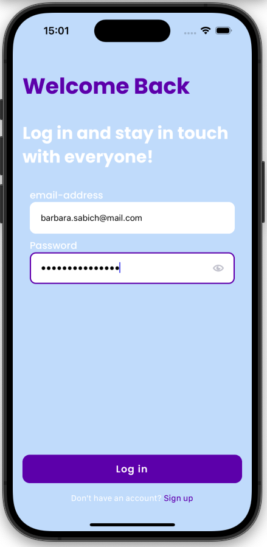
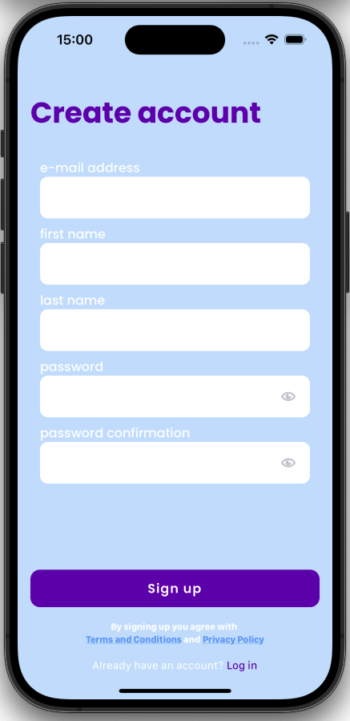
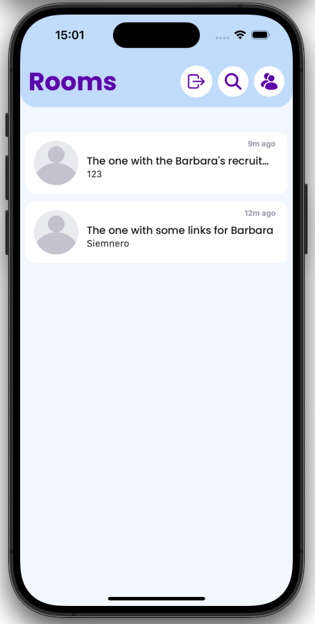
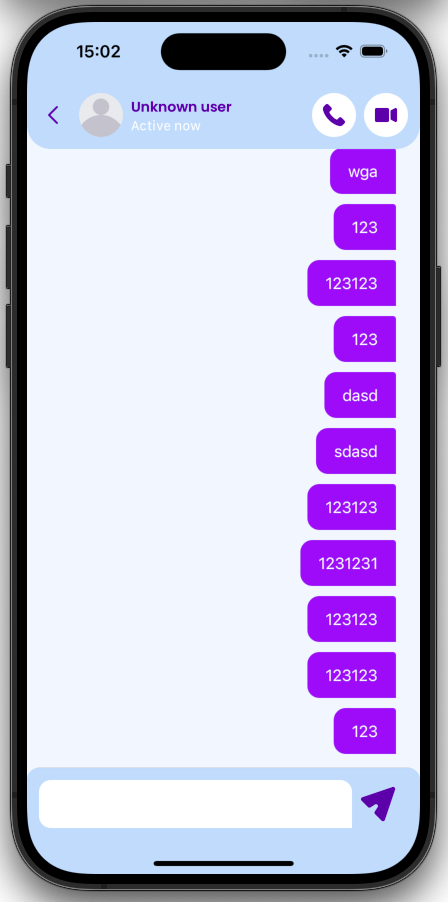

# twg-chatty-tkohan

React Native Expo chat leveraging websockets and GraphQL.



## How to run

To run this app, create a `.env` file in the root directory and add the following variables:

```
EXPO_PUBLIC_API_TOKEN=YOUR_TOKEN // If you want to use devmode
EXPO_PUBLIC_API_HTTP_URL=YOUR_HTTP_URL
EXPO_PUBLIC_API_WS_URL=YOUR_WS_URL
EXPO_PUBLIC_NODE_ENV=development
```

Then, run the following command:

```terminal
expo start

or

expo run dev //with user already logged in
```

## Photos




